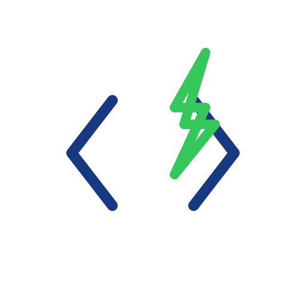

<div align="center">



# Softyanix

**Professional digital solutions — web platforms, mobile apps, AI automation, and product design.**

[](https://reactjs.org/)
[](https://www.typescriptlang.org/)
[](https://vitejs.dev/)

</div>

---

## Tech Stack

| Frontend         | Backend     | Tooling     |
| ---------------- | ----------- | ----------- |
| React 18         | Node.js     | Vite        |
| TypeScript       | Express 5   | ESLint      |
| Tailwind CSS     | Nodemailer  | PostCSS     |
| shadcn/ui        | CORS        |             |
| React Router     | Dotenv      |             |
| TanStack Query   |             |             |
| Lucide Icons     |             |             |

## Quick Start

### Prerequisites

- [Node.js](https://nodejs.org/) v18+
- npm v9+

### Setup

```bash
# Clone
git clone https://github.com/infosamyanix-inc/-softyanix.git
cd -softyanix

# Install frontend
npm install

# Install backend
cd backend && npm install && cd ..
```

### Environment

Copy the example files and fill in your values:

```bash
cp .env.example .env
cp backend/.env.example backend/.env
```

### Run

```bash
# Terminal 1 — Frontend (http://localhost:5173)
npm run dev

# Terminal 2 — Backend (http://localhost:5000)
cd backend && npm run dev
```

## Project Structure

```
├── src/
│   ├── components/       # Navbar, Footer, ScrollToTop, WhatsApp, ui/
│   ├── pages/            # HomePage, Services
│   ├── config/           # App constants
│   ├── hooks/            # Custom React hooks
│   ├── lib/              # API client, utilities
│   ├── assets/           # Images
│   ├── App.tsx           # Routing & providers
│   └── main.tsx          # Entry point
├── backend/
│   ├── routes/           # API endpoints
│   ├── utils/            # Email templates, validation
│   └── server.js         # Express server
├── public/               # Static assets, SEO files
└── package.json
```

## Contact

- **Email**: contact@softyanix.com
- **WhatsApp**: [+92 340 257 3560](https://wa.me/923402573560)
- **GitHub**: [infosamyanix-inc](https://github.com/infosamyanix-inc)

---

<div align="center">

**Built by the Softyanix Team**

</div>
